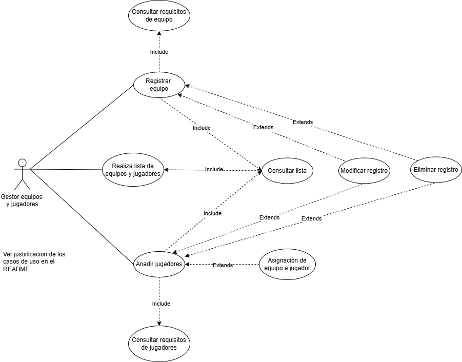
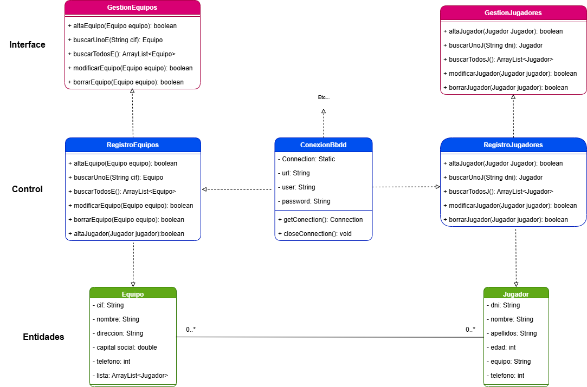

# torneo-esports-uml
Sistema de Gestión de Torneos de eSports

## Autor 
Aitor Serrano de la Fuente
https://github.com/Aitorser
 
## Descripción del Proyecto 
 
https://github.com/Aitorser/torneo-esports-uml.git
 
Este proyecto implementa un sistema de gestión de torneos de eSports utilizando UML para el modelado y Java para la implementación. 
 
## Diagramas UML 

### Diagrama de Casos de Uso 
 
 
### Diagrama de Clases 
 
 
## Estructura del Proyecto 
 
torneo-esports-uml/ ├── src/ 
│ ├── es/empresa/torneo/ 
│ │ ├── modelo/ 
│ │ ├── control/ 
│ │ ├── vista/ 
│ │ ├── Main.java 
├── diagrams/ 
│ ├── casos-uso.png 
│ ├── clases.png 
├── README.md 
├── .gitignore 
├── LICENSE (opcional) 
 
 
## Instalación y Ejecución 
1. Clonar el repositorio: 
`git clone https://github.com/usuario/torneo-esports-uml.git` 
 
2. Compilar y ejecutar el proyecto: 
`cd src javac es/empresa/torneo/Main.java java es.empresa.torneo.Main` 
 
## Justificación del diseño 

`¿Quiénes son los actores que interactúan con el sistema?`

En el sistema que me he imaginado hay dos capas de actores: 

1. El actor/es que actúan en la capa de inscripción de equipos y jugadores, que es/son los que validan y registran a los jugadores y a los equipos, y en esa medida, les dan la posibilidad o capacidad de participar en torneos.  

Por decirlo de alguna forma, sería como la Federación Española de Futbol, que es la que decide qué equipos y jugadores cumplen con los requisitos para que puedan participar en torneos (bueno, imagino que será así, que el futbol me interesa lo justo como para ver las finales de las Eurocopas si las juega España). Torneos como la Liga, Copa del Rey, Champions, entre otros. 

En esta capa, y de acuerdo con el enunciado, habría un actor que es el gestor de equipos y jugadores. 

2. La capa de organizadores de torneos, que son quienes organizan campeonatos e inscriben a los equipos en ellos, segun las decisiones tomadas en la capa anterior . Además, en esta capa se deciden los requisitos para la inscripción, se fijan las reglas para los emparejamientos, se da seguimiento a los resultados, se publica la clasificación (en función de los resultados), y, de acuerdo con la misma, se determina el ganador/es del torneo y se les da unos premios. 

Por lo tanto, en esta capa existirían tres actores, 

    2.a. Gestor del torneo. 

    2.b. Gestor de partidas y resultados. 

    2.c. Gestor de premios. 

 
`¿Cuáles son las acciones que cada actor puede realizar?`  

En la primera capa, el gestor de equipos y jugadores realiza las siguientes tareas: 

1. Hace una base de datos con tablas de jugadores y de equipos (y aquí corto el tema de los requisitos previos porque si no me puedo retrotraer a momento de su nacimiento), concretando los atributos que debe de tener cada tabla para que sean funcionales a los fines del registro de datos. 

2. Cuando le llega una solicitud de inscripción de un equipo: 

    2.a. Consulta la base de datos que ha creado y mira si ya existe.  

    2.b. Consulta la legislación vigente para ver si el equipo cumple con los requisitos (los que sean, por ejemplo, que cumpla con criterios económicos, que no tenga un nombre ofensivo o malsonante (por ejemplo, Los Cojonazos F.C.), que tenga un lugar donde jugar, entre otros) 

3. Si el equipo no existe previamente y cumple con los requisitos legales, procede a inscribirlo. 

4. Cuando le llega una solicitud de inscripción de un jugador: 

    4.a. Consulta la base de datos que ha creado y mira si ya está inscrito.  

    4.b. Consulta la legislación vigente para ver si el jugador cumple con los requisitos (los que sean, por ejemplo, edad entre otros) 

5. Si el jugador no estaba previamente inscrito y cumple con los requisitos legales, procede a inscribirlo. 

6. Si en ese momento el jugador tiene un equipo, lo asocia a ese equipo, y si no, lo deja inscrito a la espera de que algún equipo se interese en ficharlo. 

7. Además, tanto para el caso del registro de jugadores como de equipos, el actor tiene la capacidad de: 

    7.a. Modificar datos de jugadores (si es que han cambiado de peso, o cualquier otra circunstancia) o de equipos (si han cambiado su denominación, situación económica, entre otros). 

    7.b. Eliminar registros, si por circunstancias sobrevenidas al registro de los jugadores o de los equipos, hay que borrarlos, privándoles de su capacidad de participar en torneos. 

`¿Cómo se relacionan entre sí las entidades del sistema?` 

De acuerdo con el diagrama de casos de uso que he diseñado, concibo la existencia de dos entidades: 

1. Jugador 

2. Equipo 

La relación entre ambas es de asociación, en la medida en la que:

a. Hay una relación bidireccional 

b. Ambas entidades poseen existencia independiente.

En esta asociacion un jugador solo pertenece a un equipo (aunque puede pertenecer a ninguno) y un equipo puede tener uno o varios jugadores (e incluso ninguno, y que siga existiendo (por ejemplo, en lo que solventa problemas legales por impago de salarios, entre otros)). 

Las dos entidades están relacionadas con dos clases de control llamadas:

1. RegistroJugadores 

2. RegistroEquipos 

Estas clases implementan los métodos contenidos en los interfaces. Entre las entidades y las clases de control existe una relación de dependencia, puesto que no tiene sentido la clase que implementa los métodos relacionados con las entidades sin las entidades que están gestionando.

A su vez, las clases que implementan los métodos definidos en los interfaces, dependen, lógicamente, de los propios interfaces, llamados en el diagrama UML: 

1. GestionEquipos

2. GestionJugadores

Estas clase contienen todas las operaciones que he descrito en el diagrama de casos de uso, salvo las dos operaciones relacionadas con la consulta de la normativa para permitir la inscripción de los equipos y de los jugadores, que no sé dónde las puedo poner, con lo que han quedado sin representación en el diagrama de clases. 

También RegistroJugadores y RegistroEquipos están relacionadas con una clase denominada ConexionBbdd que sirve de puente entre el repositorio (en este caso una base de datos) y la estructura de gestión de jugadores y equipos. 

No he seguido dibujando diagramas relacionados con la conexión por dos motivos, el principal es que creo que va más allá de lo requerido por el ejercicio, y el secundario, pero casi tan importante, que no tengo ni idea de cómo hacerlo. 

`Justificación global`

La elección del diseño UML propuesto se justifica, en primer lugar, por su adecuación a la lógica del sistema propuesta por el ejercicio, donde el actor principal es el gestor de equipos y jugadores. Él es el responsable de validar, registrar y mantener la información necesaria para que jugadores y equipos puedan participar en torneos oficiales. Toda la interacción con el sistema parte de este actor, quien no solo introduce los datos, sino que también valida la legalidad y pertinencia de los registros, y puede modificarlos o suprimirlos.

En segundo lugar, el diseño muestra una estructura de entidades, clases de control e interfaces, permitiendo una separación de responsabilidades. Las entidades Jugador y Equipo están representadas como objetos independientes pero asociados, reflejando relaciones posibles en la vida real. Las clases de control (RegistroJugadores y RegistroEquipos) actúan como mediadoras entre estas entidades y las operaciones definidas en las interfaces, lo que permite separar la lógica de negocio y facilitar la implementación de nuevos requerimientos. Además, la inclusión de la clase ConexionBbdd muestra la via de entrada a la base de datos que refleja la gestión de los equipos y jugadores.
 
## Conclusiones  

El ejercicio me ha resultado muy enriquecedor, especialmente en la parte de la representación de los casos de uso, que es algo nuevo para mi persona. Creo que es una herramienta que posibilita al programador hacer crecer las ideas iniciales sobre un sistema, incorporando funcionalidades y caracteristicas nuevas.

La parte de la representación de las clases, por el contrario, me ha resultado un poco frustrante. Siento que he aprendido, y que sigo en el camino a convertirme en un programador decente,pero creo que, por ejemplo, en la parte de las relaciones entre clases aún tengo lagunas importantes en mi formación. 